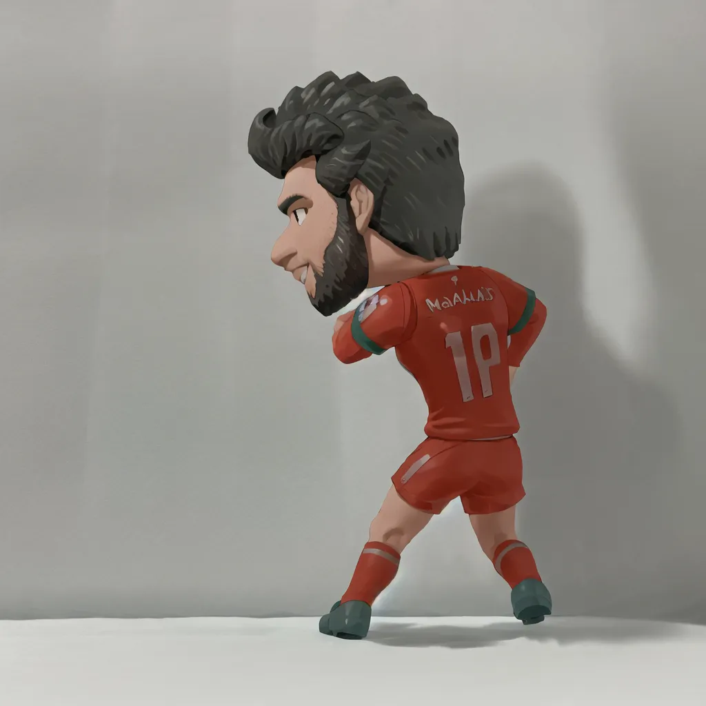

## ☁️ 新时代的设计：从 0 到 0.8 的跃迁

新时代的设计早已不再需要设计师们从 0 到 1 亲力亲为。AI 已经能够胜任 0 到 0.8 的搭建环节，剩下的部分则需要设计师根据需求、遵循审美原则去精雕细琢。这种变革不仅节省了大量的基础重复劳动，也极大地降低了设计的行业门槛。  

甚至像我这样“学遥感”的门外汉，也能深度参与到设计环节中（虽然目前主要是无偿为导师制作各种 PPT 和地理概念图）。那么，如何驾驭 AI 做好设计？我将其拆解为两个核心环节：

1. **预期控制**：如何通过指令和模型，让 AI 生成最接近脑中构思的画面？
2. **本地编辑**：如何将 AI 的半成品进行精细的后期处理与再创作？

---

## 🛠️ 深度核心：Stable Diffusion 与它的生态

在探索过程中，我发现像 Gemini 这种在线工具虽然方便，但上下文长度瓶颈和“黑盒”属性使其难以实现精准的风格把控。于是，我转向了更具生命力的本地生态：**Stable Diffusion (SD)**。

### 什么是 Stable Diffusion？
Stable Diffusion 是一种基于**潜空间扩散 (Latent Diffusion)** 技术的文本生成图像模型。简单来说，它不是在画布上涂抹，而是在“数字噪声”中提取符合你描述的形状。相比 Midjourney 的封闭性，SD 的魅力在于其完全开源的插件化生态，让我们能通过更换“大模型 (Checkpoints)”和“微调插件 (LoRA)”来实现无限可能。

### 秋叶 WebUI：设计师的操作台
对于非程序员来说，命令行可能是一道高墙。而 **秋叶 (Akiba) WebUI** 就像是给这台复杂的引擎安装了一个精美的仪表盘。通过它，我们可以轻松调节：
- **采样方法 (Sampling Method)**：决定画面迭代的路径。
- **正向/反向提示词 (Prompts/Negative Prompts)**：告诉 AI 要什么和不要什么。
- **迭代步数 (Steps)**：平衡计算时间和画面细节。

---

## 🧪 实践：训练一个属于自己的 LoRA 模型

为了让 AI 认识我手边的物品，我决定训练一个 **LoRA (Low-Rank Adaptation)** 模型。LoRA 就像是大模型的一个“轻量化补丁”，能让模型瞬间学会某个特定的角色或画风。

### 1. 准备“克隆”对象
我选择了陪我一起熬夜看球的损友——**萨拉赫 (Mohamed Salah) 的积木小人**。9 年利物浦生涯，他是安菲尔德当之无愧的法老。

**训练策略：**
- **数据集**：准备了约 50 张不同角度的实拍图。
- **环境搭建**：利用两张白纸搭建了简易“摄影棚”，使用 iPhone 16 Pro 拍摄以保证清晰度。
- **标注 (Captioning)**：为每张图生成配套的 `.txt` 描述文件，关键触发词定为 `salah toy`。

### 2. 模型训练的博弈
在训练过程中，参数的设置关乎成败。比如 `Network Alpha` 和 `Rank` 决定了模型学习的深度。训练结束后，我将得到的 LoRA 文件丢入 SD 目录，准备开启“再创作”。

---

## 🎶 插曲：Img2Img 的逼真“还愿”

在中途尝试 **img2img (图生图)** 工具时，其还原度让我目瞪口呆。它能基于我粗糙的摄影底图，保留构图的同时将其彻底重绘为电影级光影。这种“基于现实但超越现实”的体验，确实让设计的边界变得模糊。

---

## 📊 实验与复盘：逻辑的胜利还是数据的冗余？

我从 **Civitai (C站)** 和 **LiblibAI** 下载了三个不同风格的模型进行对比：
1. **二次元向**：JANKU Trained & NoobAI (极致的二次元表现)。
2. **写实向**：JuggernautXL 与 RealVisXL V5.0。

**实验发现：**
- **风格覆盖**：当我开启 LoRA 并在二次元模型中输入 `salah toy` 时，AI 成功地给模型换上了一个动漫版的萨拉赫面孔，画风自然。

- **SD 1.5 基础效果展现**：在使用部分模型时，也能看出其自身的演化。

  

- **认知偏差**：但在使用 JuggernautXL 这种写实大模型时，我发现识别极其精准，甚至能补充出很多训练集中没有的利物浦主场细节。

这引出了一个深度的思考：**AI 表现出色，究竟是因为我训练的 LoRA 足够好，还是因为它本身学习的全球数据中，萨拉赫的特征已经足够鲜明？**

经过对比实验，我发现情况更接近后者。大模型本身已经具备了极强的通识能力，而我训练的 LoRA 更多是起到一个**引导和具象化**的作用，将“萨拉赫”这个抽象概念与“积木人”这个具体形态结合在了一起。

---

## 📝 阶段总结

这次学习让我意识到，AI 设计的终点不是取代设计师，而是要求设计师从“画匠”变身为“导演”。你需要懂光影、懂模型权重、更要懂得如何与底层的算法逻辑进行博弈。

当然，作为利物浦球迷，我更高兴的是能用科技把自己心爱的球员带入各种奇幻的二次元世界。周中欧冠对阵大巴黎，希望萨拉赫依然是安菲尔德无所不能的法老！YNWA!
