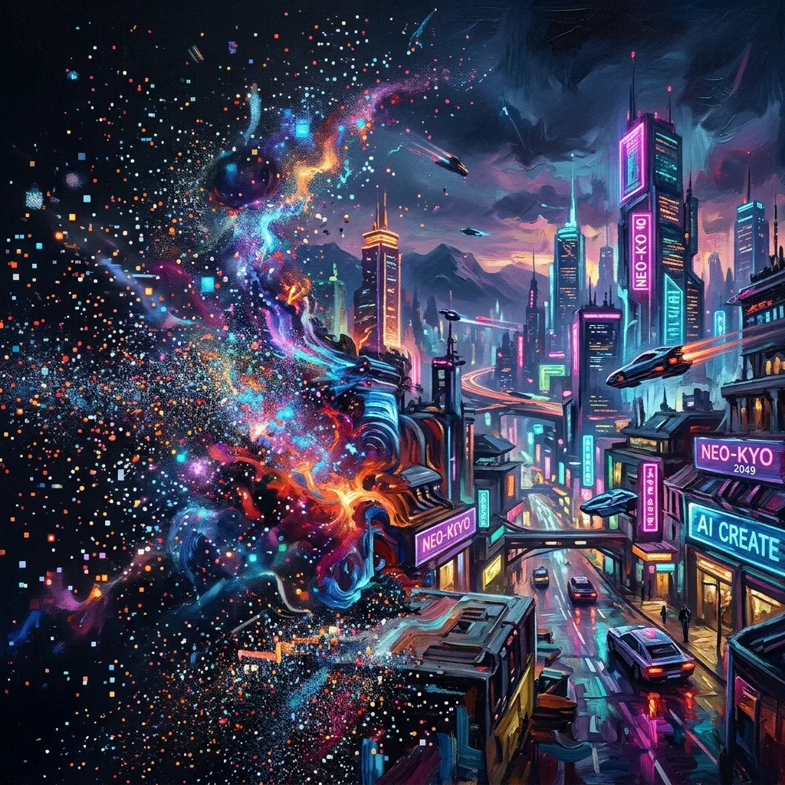
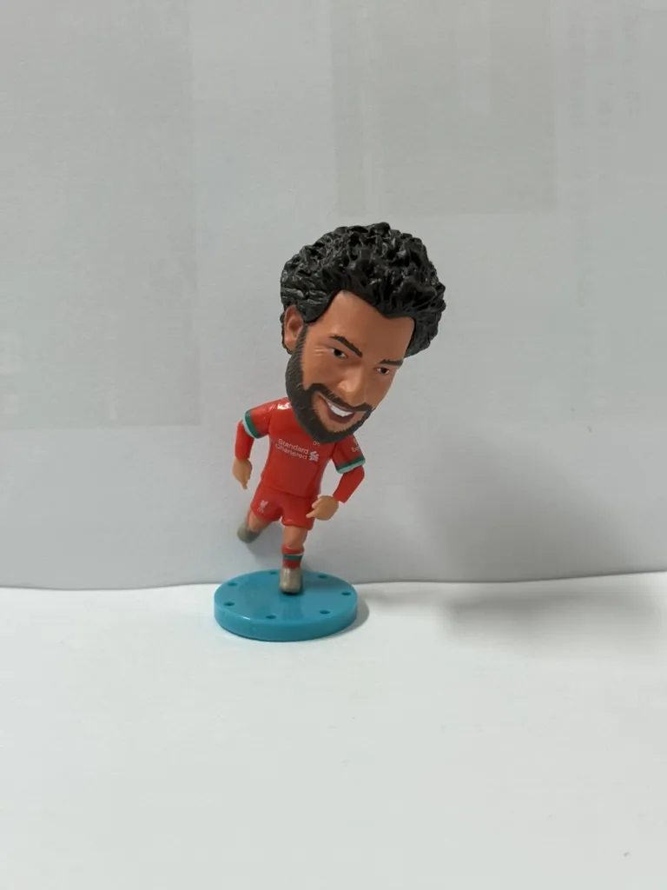
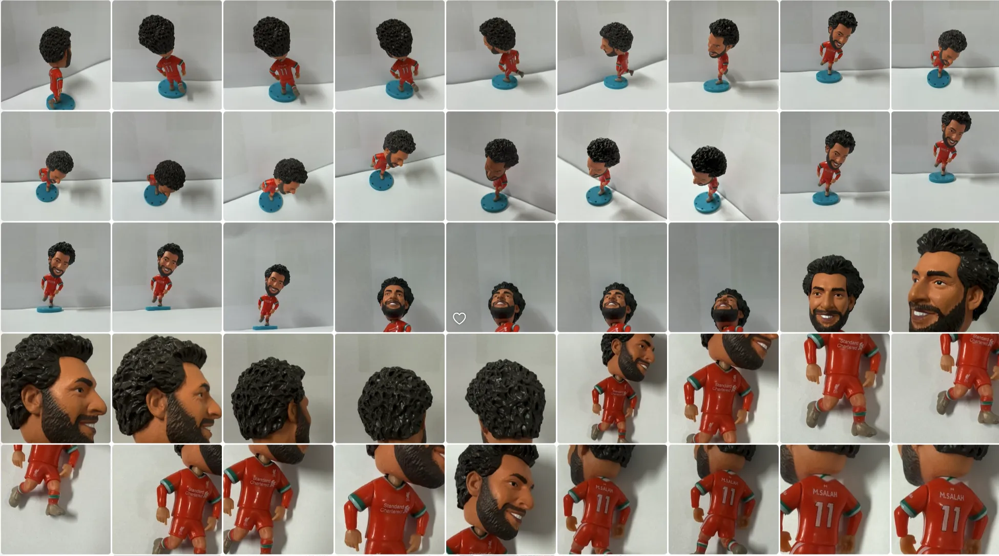

## 🧭 导读

在 AI 时代，设计不再仅仅是像素的堆砌，而是“预期控制”与“工程思维”的交织。为了方便阅读，我将内容拆解为**学习笔记**与**实战输出**两个板块，点击下方标题即可展开查看详情。

---

# 📐 板块一：Stable Diffusion & LoRA

## ☁️ 新时代的设计：从 0 到 0.8 的跃迁

新时代的设计早已不再需要设计师们 from 0 to 1 亲力亲为。AI 已经能够胜任 0 到 0.8 的搭建环节，剩下的部分则需要设计师根据需求、遵循审美原则去精雕细琢。这种变革不仅节省了大量的基础重复劳动，也极大地降低了设计的行业门槛。  

甚至像我这样“学遥感”的门外汉，也能深度参与到设计环节中（虽然目前主要是无偿为导师制作各种 PPT 和地理概念图）。那么，如何驾驭 AI 做好设计？我将其拆解为两个核心环节：

1. **预期控制**：如何通过指令和模型，让 AI 生成最接近脑中构思的画面？
2. **本地编辑**：如何将 AI 的半成品进行精细的后期处理与再创作？

---

## 🛠️ 深度核心：Stable Diffusion 与它的生态

在探索过程中，我发现像 Gemini 这种在线工具虽然方便，但上下文长度瓶颈使其难以实现精准风格把控。于是，我转向了更具生命力的本地生态：**Stable Diffusion (SD)**。

### 什么是 Stable Diffusion？
Stable Diffusion 是一种基于**潜空间扩散 (Latent Diffusion)** 技术的文本生成图像模型。简单来说，它不是在画布上涂抹，而是在“数字噪声”中提取符合你描述的形状。相比 Midjourney 的封闭性，SD 的魅力在于其完全开源的插件化生态。

### 秋叶 WebUI：设计师的操作台
对于非程序员来说，命令行可能是一道高墙。而 **秋叶 (Akiba) WebUI** 就像是给这台复杂的引擎安装了一个精美的仪表盘。通过它，我们可以轻松调节采样方法、提示词权重以及迭代步数。

---

## 🧪 实践：训练一个属于自己的 LoRA 模型

为了让 AI 认识我手边的物品，我决定训练一个 **LoRA (Low-Rank Adaptation)** 模型。LoRA 就像是大模型的一个“轻量化补丁”，能让模型瞬间学会某个特定的角色或画风。

- **克隆对象**：陪伴我的 **萨拉赫 (Mohamed Salah) 积木小人**。
- **数据集**：准备了约 50 张 iPhone 16 Pro 拍摄的不同角度实拍图，触发词 `salah toy`。

---

## 🎶 插曲：Img2Img 的逼真“还愿”

在中途尝试 **img2img (图生图)** 工具时，其还原度让我目瞪口呆。它能基于我粗糙的摄影底图，保留构图的同时将其彻底重绘为电影级光影。

---

## 📊 实验与复盘：逻辑的胜利还是数据的冗余？

我对比了二次元向 (JANKU) 与写实向 (JuggernautXL) 模型，发现：
- **风格覆盖**：开启 LoRA 并在二次元模型中输入 `salah toy` 时，AI 成功地给模型换上了一个动漫版的萨拉赫面孔。
- **实验结论**：大模型本身具备极强的通识能力，LoRA 更多是起到**引导和具象化**的作用，将“萨拉赫”的特征与“积木人”结合。

## 📝 阶段总结

这次学习让我意识到，AI 设计的终点不是取代设计师，而是要求设计师从“画匠”变身为“导演”。YNWA!

# 🚀 板块二：AI文本排版

## 🚀 AI 设计实战

这篇博文记录了我关于 **AI Native** 核心能力的深度思考：在 AI 时代，我们不要仅仅把 AI 当作“搜索引擎”，而应该将其视为“工作流”的一部分。

### 🔧 核心能力：最后比拼的是工程思维
- **定义问题/拆解问题**：给出系统化解决方案。
- **闭环输出**：不仅是生成，而是完成。

---

## 📱 小红书版文章输出

为了更好呈现思考，我开发了 **Agent Skill: [xhs-article-slides](https://github.com/972831161/12AsrtoBlog/blob/main/.agents/skills/xhs-article-slides/SKILL.md)**。

这个 Skill 可以自动将长文逻辑拆解并转化为符合 **3:4 比例的极简风格幻灯片**，且可以选择极简风格或者是宇宙科幻风。这种方式既适合移动端沉浸式阅读，也契合 Z 世代的碎片化阅读偏好。

- [🔧 最后比拼的是工程思维](/ai-design/index.html). (极简风；内容来自小红书博主 [不好惹的娃娃脸 Guxi](https://www.xiaohongshu.com/user/profile/5b2f04e511be105be812f722?xsec_token=YBpI79WtRsIs_Hhvh7dWpn6N9NEG6Nvqk7OrYLgBXCWkU=&xsec_source=app_share&xhsshare=CopyLink&shareRedId=ODY5NTdJOT82NzUyOTgwNjY0OTc4Nj5A&apptime=1776260779&share_id=2ac5c7b4c32f4680abe6575fa25b0823))
- **项目：宇宙电动内容资产活化** (利用 [html-ppt-skill](https://github.com/lewislulu/html-ppt-skill) 实现的多风格一键转化案例)
    - [🚀 宇宙电动：悬崖边的三年](/universe-ebike-cyber-slides/index.html). (科幻极简风)
    - [📈 宇宙电动：品牌发展全史](/universe-ebike-full/index.html). (全量沉浸风)
    - [🎯 宇宙电动：VAPOR 产品路演](/universe-ebike-pitch/index.html). (商务路演风)
    - [📱 宇宙电动：小红书内容复用示例](/universe-ebike-xhs/index.html). (移动端适配)
- [📊 宇宙电动：官方号内容升级建议](/universe-ebike/mission-archive.html). (集成方案；包含 66 条记录的全量资产审计与 12 条黄金资产重构手册)

---

> **YNWA!** 信仰与科技的碰撞，让设计的边界变得模糊。

