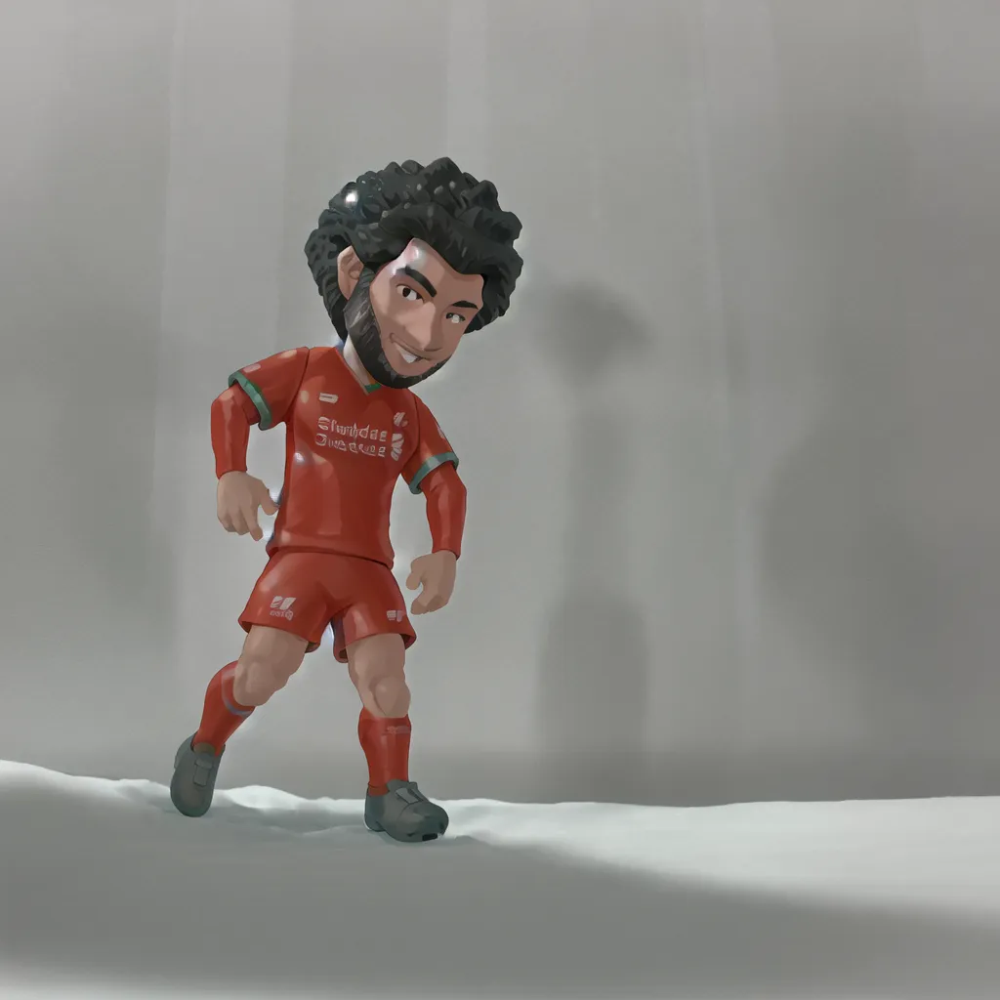
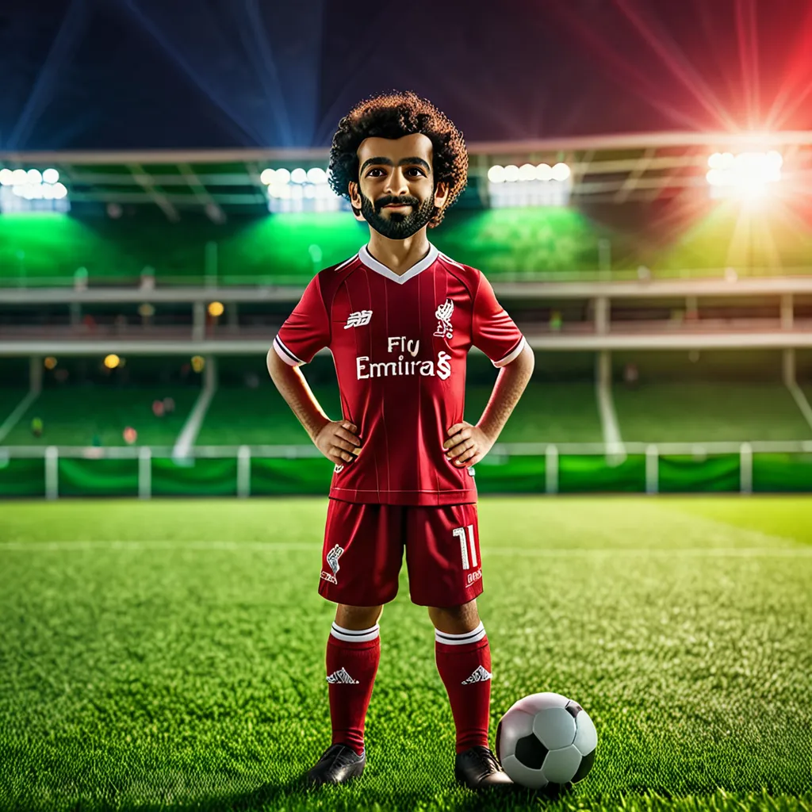
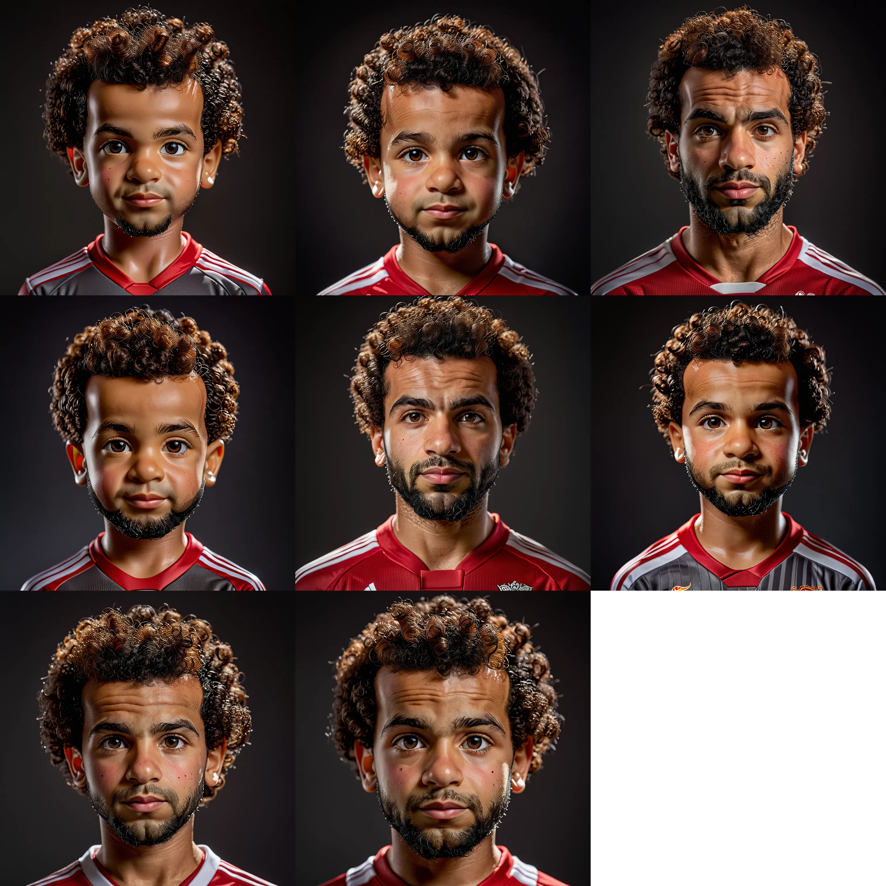
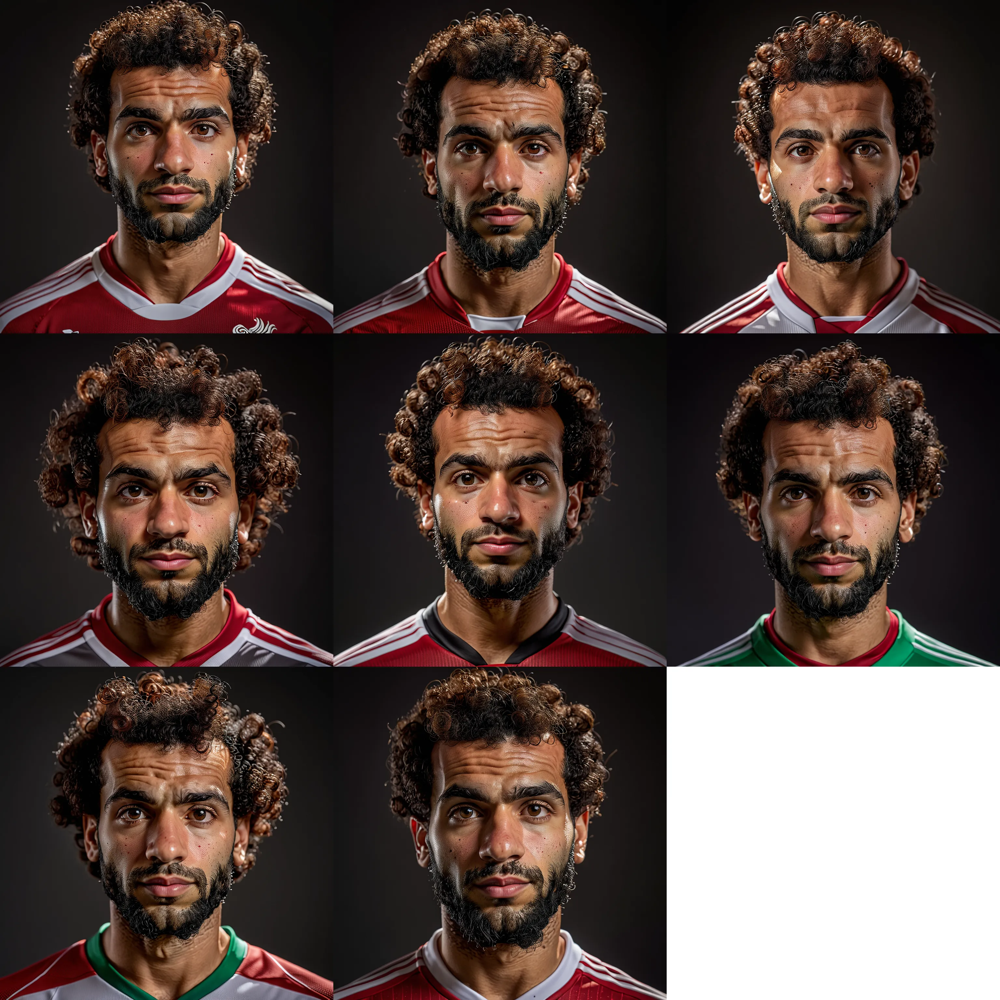
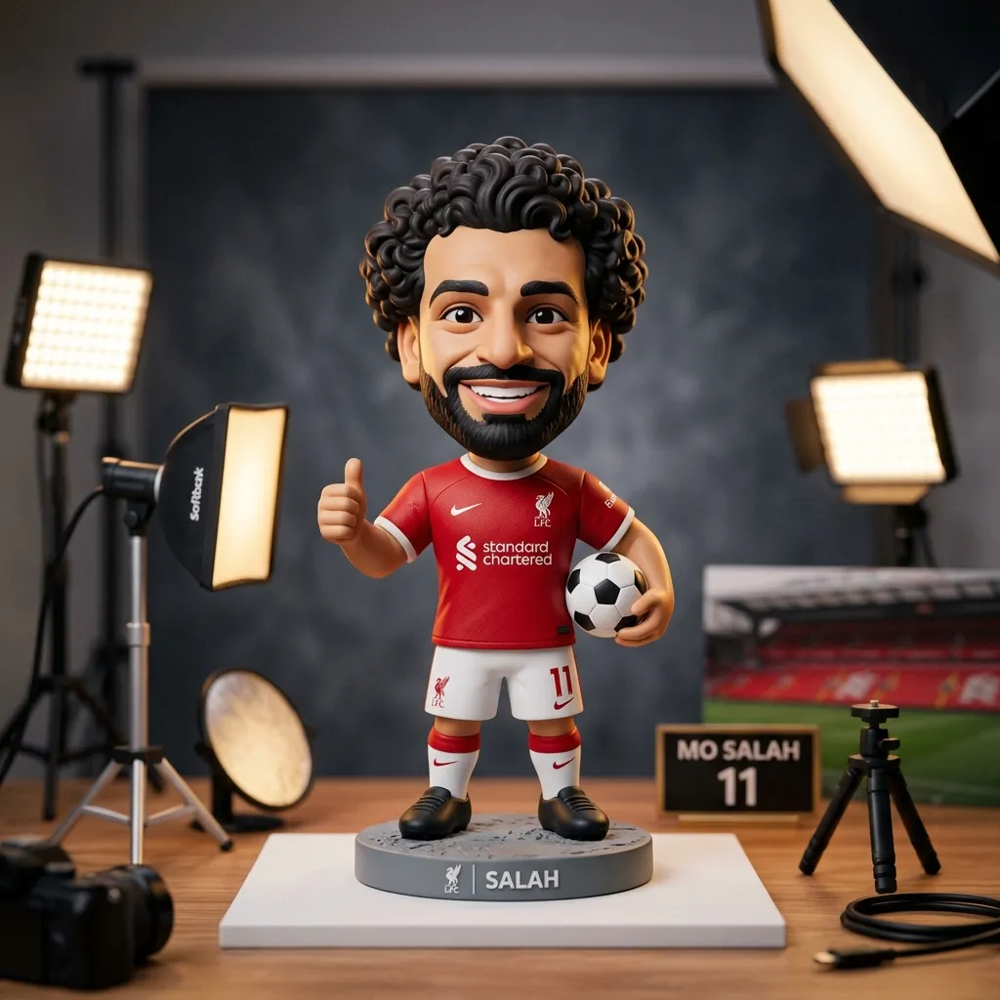
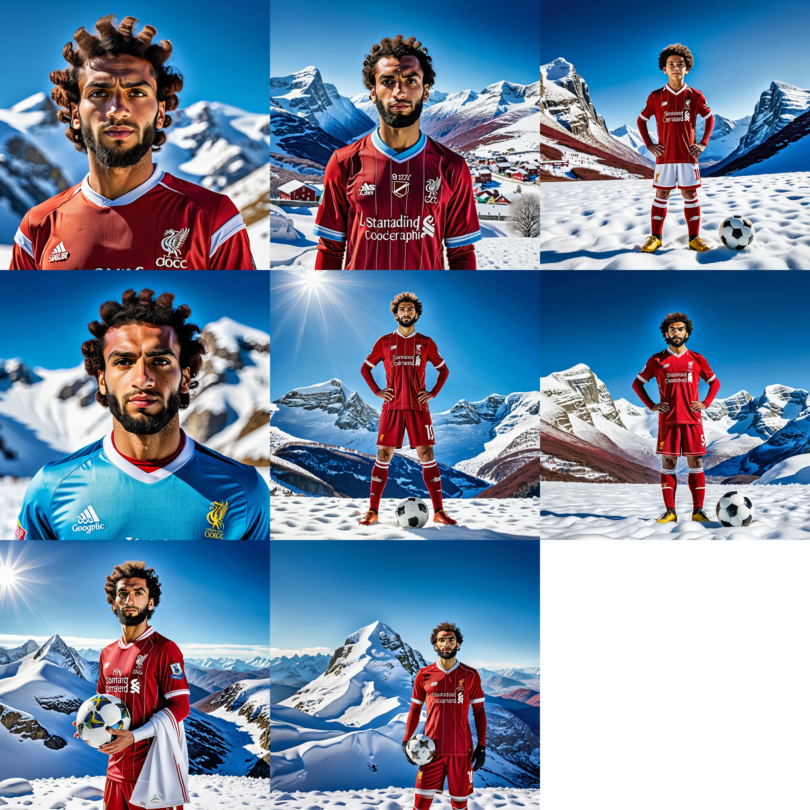
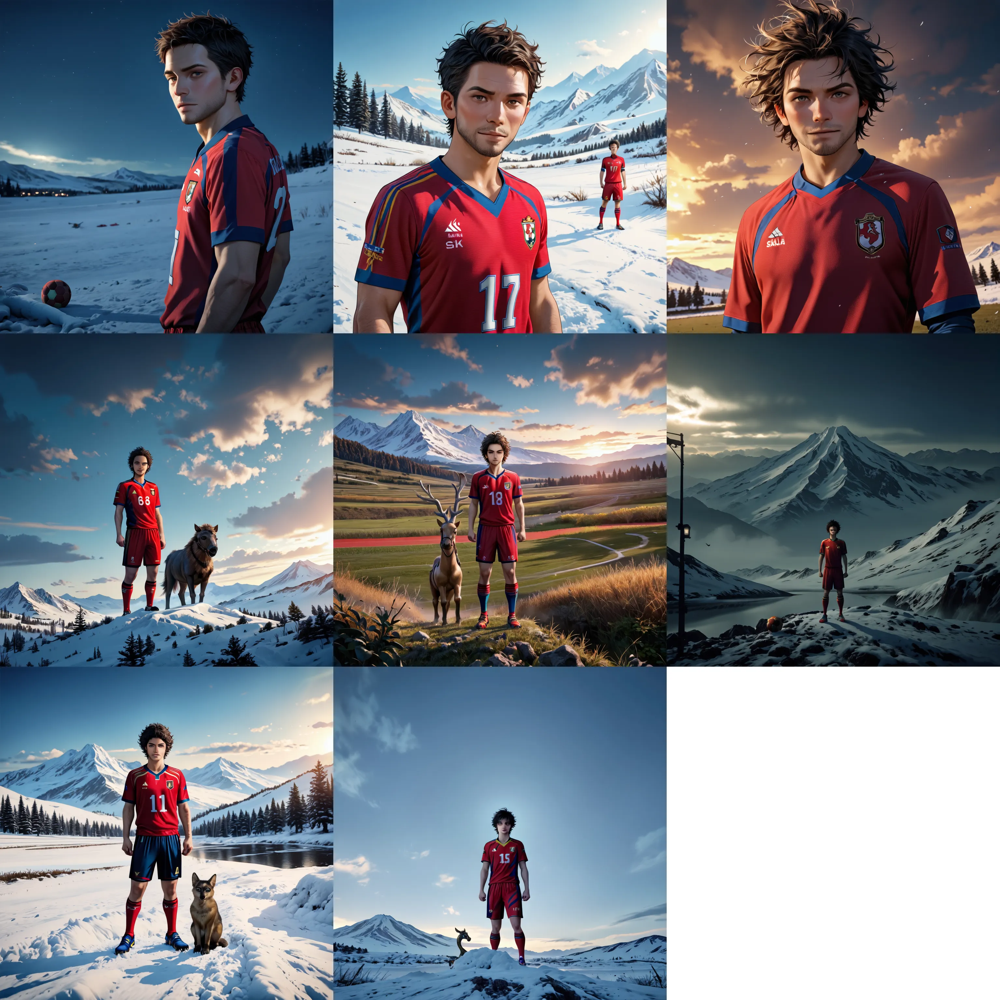

  <h2 id="core-formula" class="artistic-formula">
    既有经验
    +
    AI
    =
    竞争力
  </h2>

---

## 📐 板块一：Stable Diffusion & LoRA

### ☁️ 新时代的设计：从 0 到 0.8 的跃迁

现在做设计，已经不需要从 0 到 1 凡事亲力亲为了。0 到 0.8 的活儿 AI 都能帮你搞定，剩下的 0.2 才是设计师施展审美、精雕细琢的“胜负手”。这种变革省去了大量的重复劳动，设计的门槛也跟着降了下来。

甚至像我这样“学遥感”的门外汉，也能深度参与进来（虽说目前只是在帮导师做 PPT 和地理概念图）。那么，怎么才能驾驭好 AI？我觉得核心就两点：

1. **预期控制**：用指令和模型，让 AI 吐出来的画尽量贴合脑子里的构思。
2. **本地编辑**：给 AI 的“半成品”做精细化的后期处理。

---

### 🖥️ 工具选择：Stable Diffusion 与它的生态

折腾一圈下来，我发现像 Gemini 这种在线工具虽然方便，但风格精准度很难把控。最后还是回到了更有生命力的本地生态：**Stable Diffusion (SD)**。

#### 什么是 Stable Diffusion？
简单说，它不是在画布上涂抹，而是在“数字噪声”中提取符合你描述的形状。相比 Midjourney 的封闭，SD 的魅力在于它完全开源的插件生态。

#### 秋叶 WebUI：设计师的操作台
命令行对非程序员来说还是太硬了。**秋叶 (Akiba) WebUI** 就像是给复杂的引擎装上了一个直观的仪表盘，采样方法、提示词权重、迭代步数，点点鼠标就能调。

---

### 🧪 实测：练一个属于自己的 LoRA 模型

为了让 AI 认出我桌上的东西，我决定练一个 **LoRA (Low-Rank Adaptation)** 模型。它就像是大模型的一个“轻量补丁”，能让模型瞬间学会某个特定的角色或画风。

- **克隆对象**：陪我办公的 **萨拉赫 (Mohamed Salah) 积木小人**。
- **数据集准备**：
    - **实物摄影**：为了让模型能“全方位无死角”地认出这个积木人，我用 iPhone 16 Pro 拍摄了约 **50 张** 涵盖俯视、侧视、仰视以及特写角度的实操图。
    - **逻辑关联**：在打标签（Captioning）时，触发词设为 `salah toy`。
    - **实测痛点**：因为积木本身的质感跟“真人”有次元差，如何平衡这种反差成了训练的关键。

### 🖼️ 实验进阶：多模型对比与“提示词博弈”

在有了 LoRA 这个“专属外挂”后，我尝试了不同底模和提示词组合，发现了一些非常有意思的逻辑细节：

#### 1. 默认模型 vs 高级模型
起初我直接用了 SD 1.5 的默认底核，出图质感中规中矩，只能算是“画得像”。随后我从 C 站下载了更高级的 **Realistic** 和 **JuggernautXL** 写实类模型进行实验。

  

    
SD 1.5 默认底模 (中规中矩)

  

  

    
高级写实模型 (光影/质感飞跃)

  

- **对比发现**：高级模型对光影映射（如金属积木的反光）处理得远比默认模型细腻，质感得到了飞跃式的提升。

#### 2. “幼年萨拉赫”之谜：提示词的权重博弈
在实验过程中出现了一个有趣的插曲：由于我在提示词里加入了 `toy`（为了触发我的 LoRA 特征），AI 居然固执地生成了一个“幼年版”萨拉赫，这大概是因为 AI 的逻辑里，“玩具”往往和“童年”是强关联的。

- **意外结局**：没设置反向提示词前，萨拉赫看起来只有 10 岁。
- **纠偏方案**：通过在 **Negative Prompt (反向提示词)** 明确排除 `child, kid, young` 后，终于得到了那个英气飒爽的利物浦核心。

  

    
反向提示词设置前

  

  

    
设置后（锁定年龄段）

  

#### 3. 场景拓展与后期微调
我还尝试把萨拉赫丢到了各种离谱的场景里，比如漫天大雪的极地。同时，为了修正一些细节偏差（如积木边缘的毛刺），我配合使用了 **img2img (图生图)** 进行局部重绘。

  

    
LoRA 权重触发测试

  

  

    
img2img 局部重绘后期

  

---

### 📊 总结复盘：数据和逻辑的博弈

我对比了动漫风 (JANKU) 和写实风 (JuggernautXL) 模型后发现：
- **风格覆盖**：只要加上 LoRA，动漫模型也能准确画出萨拉赫的脸。
- **结论**：大模型的通识能力极强，LoRA 的作用是**引导和具象化**，把特定的特征和通用概念结合起来。

### 📝 阶段总结&&未来计划

前期训练集准备是至关重要的，决定了最后输出模型的基本质量。其中LoRA模型训练时的提示词一定要小心设置，尽量设计成没有实际意义的，比如说将提示词设计为salah，其大模型里很有可能已经学习了萨拉赫的有关先验知识，这就让LoRA模型的实际作用很难评估。未来我计划继续探索不同模型和参数的组合，尝试训练更多不同类型的LoRA模型，并探索如何将AI生成的内容与实际工作流更紧密地结合起来。设计出能应用于e-bike上的一套完整自动化工作流。

## 🚀 板块二：AI 文本排版

### 🔧 实战思考：AI Native 的工作流

这部分记录了我对 **AI Native** 的深度思考：别只把 AI 当成“高级搜索引擎”，要把它真正嵌入到工作流里。

#### 核心能力：最后拼的是工程思维
- **拆解问题**：给出系统化的处理方案，而不仅仅是问一句答一句。
- **闭环输出**：生成的目的是为了完成，而非仅仅是产生内容。

---

### 实战成果1：文章转幻灯片

为了让思考更直观，我手搓了一个 **Agent Skill: [xhs-article-slides](https://github.com/972831161/12AsrtoBlog/blob/main/.agents/skills/xhs-article-slides/SKILL.md)**。

它能自动拆解长文逻辑，生成 **3:4 比例的极简风幻灯片**（也可以选宇宙科幻风）。这种形式更适合移动端的沉浸式阅读，也更对 Z 世代碎片化阅读的胃口。以下是一些具体案例：

- <a href="/ai-design/index.html" data-astro-reload>🔧 最后拼的是工程思维</a>。 （内容来源：小红书博主 [不好惹的娃娃脸 Guxi](https://www.xiaohongshu.com/user/profile/5b2f04e511be105be812f722)）
- **项目：宇宙电动公众号内容“视频化”活化** （利用 [html-ppt-skill](https://github.com/lewislulu/html-ppt-skill) 实现的多风格一键转化。）
    - <a href="/universe-ebike-cyber-slides/index.html" data-astro-reload>🚀 宇宙电动：悬崖边的三年</a>。（科幻版）
    - <a href="/universe-ebike-full/index.html" data-astro-reload>📈 宇宙电动：品牌发展全史</a>。（全量版）
    - <a href="/universe-ebike-pitch/index.html" data-astro-reload>🎯 宇宙电动：VAPOR 产品路演</a>。（商务版）
    - <a href="/universe-ebike-xhs/index.html" data-astro-reload>📱 宇宙电动：小红书内容复用示例</a>。（适配移动端）

> [!NOTE]
> **关于 `html-ppt-skill` (by lewislulu)**：
> 这是我在项目中引入的一款非常硬核的开源工具，可以极大地提升内容转化的效率。
> - **基本功能**：支持将 Markdown 或 HTML 内容一键导出为具备高度交互性的幻灯片，内置多种专业皮肤。
> - **快捷操作**：通过键盘⬅️  ➡️播放页面，生成的页面支持 `Space / Enter` 下一页，`N` 键切换演讲者模式，以及 `F` 键全屏。

---

## 💼 板块三：工作任务

同步老程和昊禹哥布置的工作任务：

- [🔍 宇宙电动：舆情内容核查网站](/ebike-review/index.html)。 （逐条审查各平台账号内容、评论是否有潜在风险）
- [📊 宇宙电动：官方号内容升级建议](/universe-ebike/mission-archive.html)。 （评估老板个人账号内容是否有迁移到官号下的价值）

