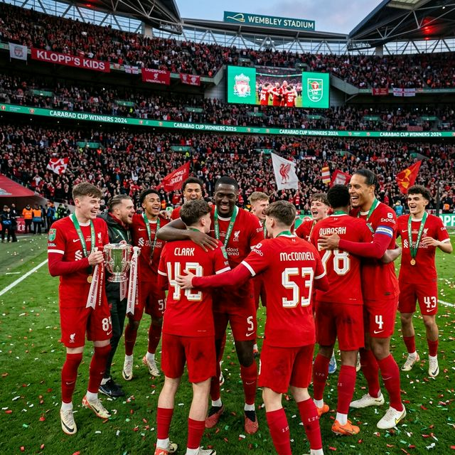
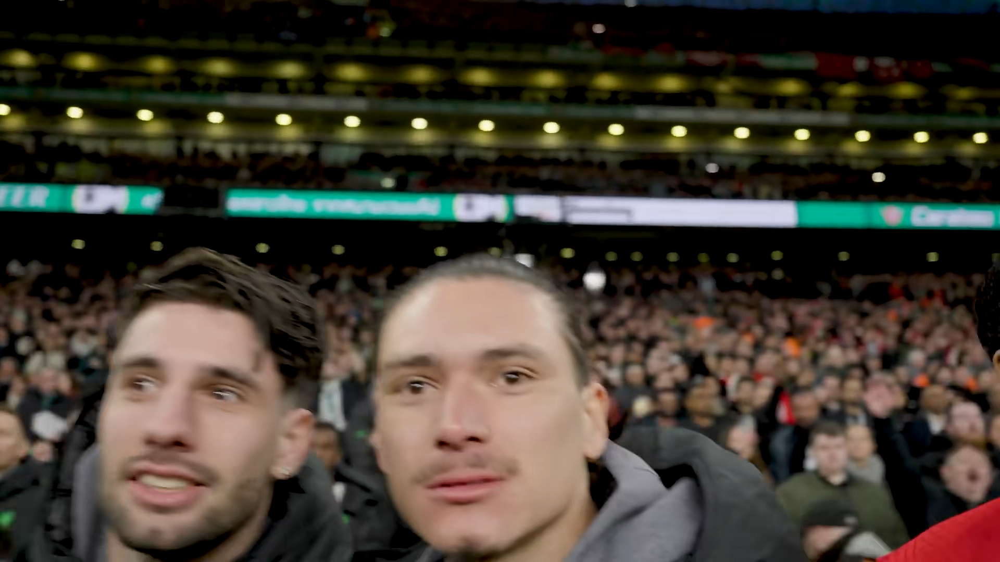
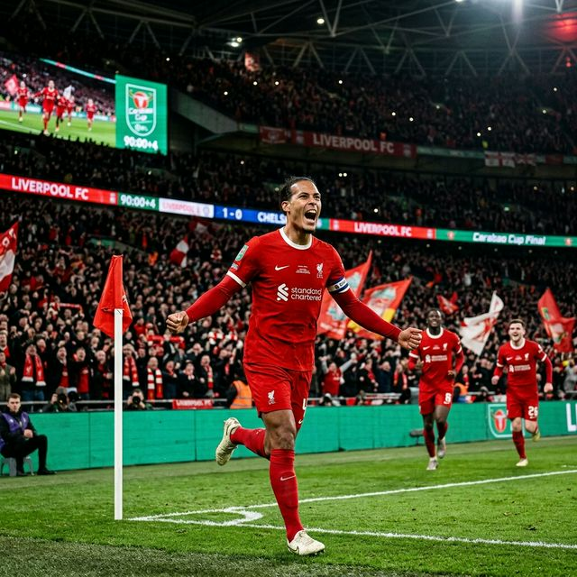

# Klopp's Kids: 2024卡拉宝杯，利物浦残阵夺冠的奇迹

北京时间2024年2月26日凌晨，伦敦，温布利球场。这个夜晚，注定会被载入利物浦足球俱乐部的史册。

## 1. 绝境：伤病满营的利物浦

赛前，利物浦的主力名单几乎变成了一份“病历表”。顶级球星们悉数缺阵：
- **阿利松 (Alisson Becker)**
- **阿诺德 (Trent Alexander-Arnold)**
- **萨拉赫 (Mohamed Salah)**
- **努涅斯 (Darwin Núñez)**
- **若塔 (Diogo Jota)**
- **索博斯洛伊 (Dominik Szoboszlai)**
- **蒂亚戈 (Thiago)**
- **马蒂普 (Joel Matip)**
- **琼斯 (Curtis Jones)**

面对整建制的切尔西，利物浦仿佛是在用“残阵”对抗“豪阵”。但正如克洛普常说的，这就是我们的方式。

---

## 2. 小孩哥：克洛普的青年近卫军

当首发名单出来时，很多人都在问：“这群孩子是谁？”
面对压力，克洛普毫不犹豫地换上了一批批学院系的“小孩哥”：
- **康纳·布拉德利 (Conor Bradley, 20岁)**：在右路像老将一样沉稳。
- **贾雷尔·宽萨 (Jarell Quansah, 21岁)**：替补上阵守住防线。
- **博比·克拉克 (Bobby Clark, 19岁)**：在中场无畏拼抢。
- **詹姆斯·麦康奈尔 (James McConnell, 19岁)**：沉着冷静。
- **杰登·丹斯 (Jayden Danns, 18岁)**：差点头球破门的小将。

解说员那句“Klopp's kids vs Chelsea's billion-pound bottle jobs”成了全场最经典的注脚。

*图1：范戴克与年轻球员们共同捧起奖杯，象征着利物浦精神的传承*

---

## 3. 绝杀：范戴克的队长时刻

比赛进入加时，双方僵持不下。就在第118分钟，利物浦获得角球机会。
齐米卡斯弧线开出，队长 **范戴克 (Virgil van Dijk)** 泰山压顶，头球破门！那一刻，温布利球场的红色海洋沸腾了。

## Bilibili

<iframe width="100%" height="468" src="//player.bilibili.com/player.html?bvid=BV1pF4m157y3&p=1&autoplay=0&t=239" scrolling="no" border="0" frameborder="no" framespacing="0" allowfullscreen="true"> </iframe>
这是一个属于利物浦队长的时刻，也是他再次证明自己世界第一中卫身价的时刻。不逆转，非红军！

---

## 4. 瞬间：为什么我爱利物浦

作为一个球迷，总会有一个瞬间让你彻底沦陷。
对我而言，就是看着那些连全名都还叫不全的孩子们，在加时赛面对上亿身价的对手时，依然疯狂奔跑、无所畏惧的样子。
那就是利物浦的 DNA——**永不言弃 (Never Give Up)**。

赛后的庆祝更是疯狂：
- **努涅斯 (Darwin Núñez)**：虽然由于伤病没能上场，但在范戴克进球的一瞬间，他直接从看台上翻越广告牌，冲进场内狂奔庆祝，甚至顾不得自己的伤势。
- **科纳特 (Ibrahima Konaté)**：他在场上狂野地摇晃小将，甚至把教练组都卷入了庆祝的漩涡。

*图2：带头大哥的担当，这一刻温布利只听得见红色利物浦的声音*

---

## 5. 写在后面

我们热衷于以弱胜强，小人物战胜大boss的故事，当听到终场哨起，全队拥抱庆祝，你怎能不热泪盈眶，怎能不即刻参军？

**You'll Never Walk Alone!**
