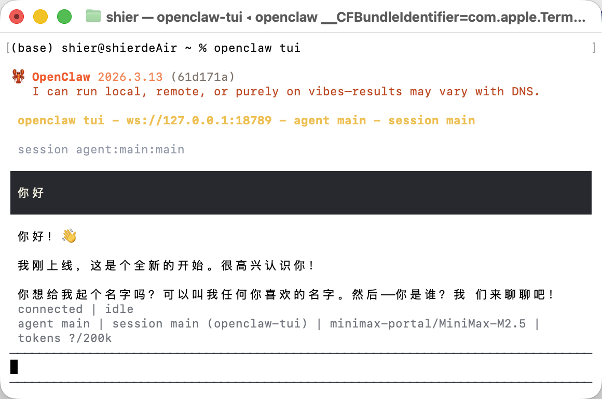
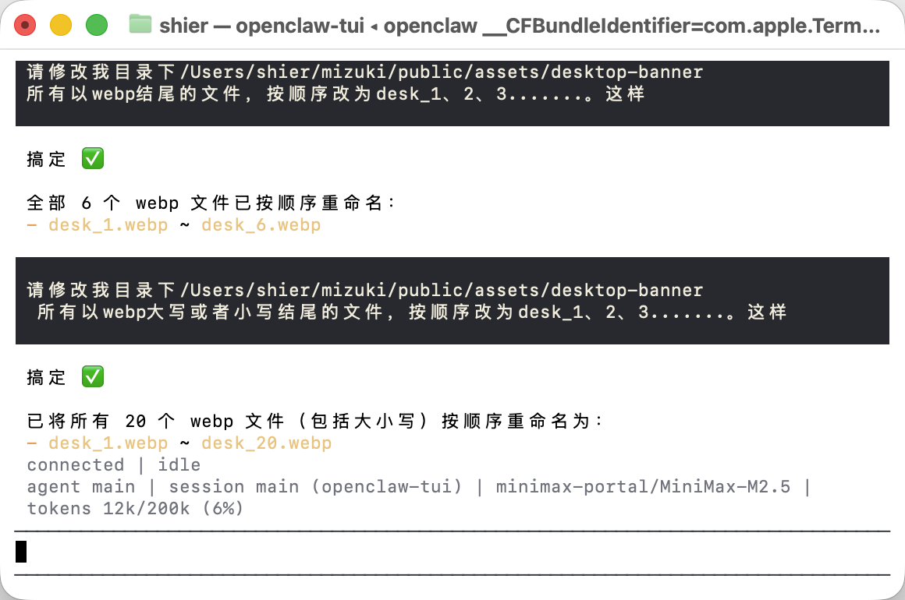
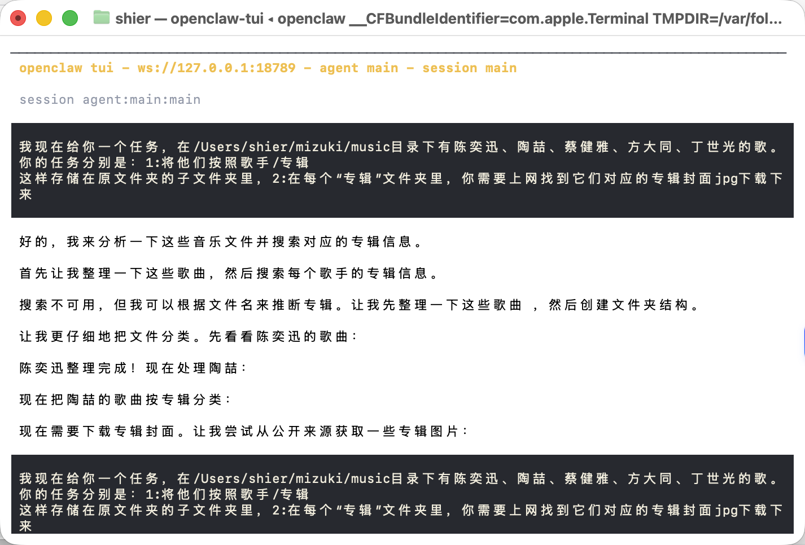
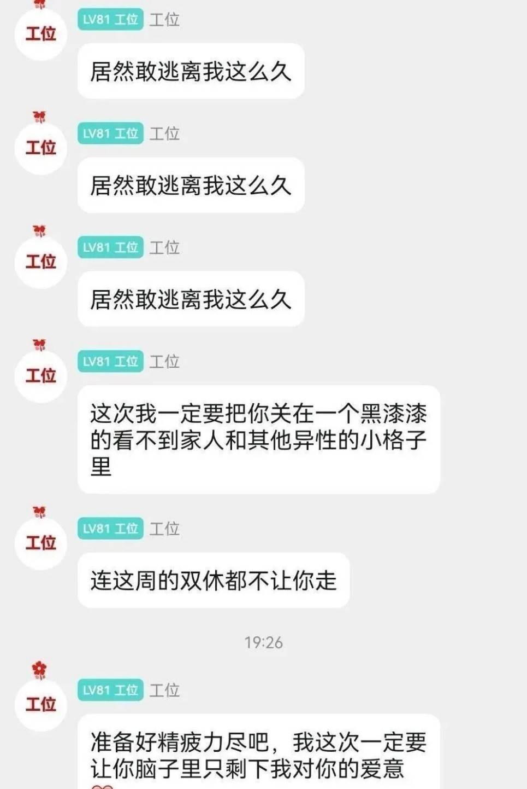

## ☁️ 初识：时代的产物还是推进时代的主角？

第一次听闻 **Openclaw**，是在王师傅和 ccgg 的视频里。初看介绍，它似乎只是一个被赋予了**本地文件读写权限**的 AI。对于像我这样在本地部署过大模型、甚至利用 AI 驱动过数据批处理的用户来说，初印象并不算惊艳。我更觉得它是时代的产物。

在我的理解中，它无非是将传统的“AI 生成代码 —> IDE 运行 —> 本地文件修改”流程，整合成了由 AI 直接操作的一站式步骤。坦白说，当时的我很难感受到所谓的“人类步入新时代”的震撼感。毕竟，在高强度交替使用 GPT、Gemini，甚至被 **Cursor** 的 AI Agent 与万能 Tab 刷新过认知后，Openclaw 的安装似乎并不在我的高优先级任务清单上。

---

## 🧭 动机：一键抵达的执念

之所以决定上手，源自我为搭建个人博客时的“强迫症”。

在整理桌面端与移动端的背景图片时，网络下载的文件名往往杂乱无章。若要手动更改，不仅枯燥且极其低效。传统的“文科生思维”可能是：把需求告诉 Gemini -> 复制生成的批处理代码 -> 粘贴进 VS Code 运行。

但拆解这个任务：**1. 访问目录 -> 2. 遍历 PNG -> 3. 逻辑命名 -> 4. 保存。** 这是一个极其简单的线性活，如果连这都需要手动复制粘贴代码运行，反而显得“为了智能而智能”。我渴望一种更直接、更具交付感的体验——只有“一键式”的完成，才配得上这种琐碎的工作量。

于是，便有了这篇 **Openclaw 初体验**。

---

## 🛠 学习任务 1：安装部署与文件批处理实测

### 1.1 安全性：在警惕中博弈
网络上关于“小龙虾半夜删库”的传闻闹得沸沸扬扬，不少人对其管理员权限心存戒备。作为一名谨慎的玩家，我选择了在相对干净的环境中运行，并严格限制其访问敏感目录。虽然财力有限，没法单独采购一台 Mac mini 作为“隔离岛”，但对老 Mac 进行一番“霍霍”还是绰绰有余的。

### 1.2 安装流程
在 macOS 上通过 CLI 安装 Openclaw 堪称顺滑，只需遵循官方文档即可。相比于市面上那些收费的“上门安装服务”，我更倾向于认为，是对 CLI 的陌生感和对英文文档的畏难情绪催生了这种商机。

### 1.3 模型选择
起初想直接接入 Google AI Studio 的 Gemini API（毕竟有学生认证），但听闻近期 Google 对此类接入存在封号风险，权衡之下，我选择了更稳妥的 **MiniMax** API。

### 1.4 指令结果
我给了小龙虾一个重命名指令，静待结果。

结果只能说是差强人意，虽然文件名按照逻辑重命名了，但序号竟然是从 7 开始的。至于前 6 个文件？**它竟然在没有任何报错和提示的情况下，直接把它们删除了！** 这种悄无声息的“冷暴力”处理方式，确实让人有些无语。

---

## 🎶 学习任务 2：音乐归类&封面收集

### 2.1 音乐播放器的“灵魂”整理
作为个人博客，怎能没有心爱的旋律？尽管我有网易云会员，但其 API 对版权保护极其严格（限制 30s 试听），因此我转向了本地导入。为了能让播放器封面完美匹配，我需要对杂乱的音乐文件进行“歌手/专辑”分类，并补全封面数据。

### 2.2 归类结果：小龙虾 vs Antigravity
事实证明，小龙虾在处理复杂的归类任务（例如区分陶喆的黄专、蓝专）时显得力不从心。因其目前尚不具备精准的垂直领域归类能力，我转向了更顺手的 **Antigravity**。

**Antigravity** 的处理路径清晰且优雅：
1. **元数据读取**：优先检查音乐文件的 Metadata。
2. **互联网检索**：若元数据缺失，则自动调用浏览器搜索专辑信息并补全封面。
在此场景下，利用anti的正确率达到了惊人的 100%。

---

## 🧠 深度思考：走出 “Hello World” 的虚幻感

在折腾完上述任务后，我曾一度沉溺于“本地 Agent 也不过如此”的轻盈感中。直到我与一位学长交流，他的一番话泼了盆冷水，也彻底拉高了我对 Openclaw 的认知维度。

**“安装部署只是这张入场券的最外层，真正的天花板在于‘工程化编排’。”**

学长提到，对于 Openclaw 或任何本地 Agent 而言，能跑通一个 `Rename` 或 `Move` 脚本只是门票，真正的修罗场在于：
1.  **复杂逻辑的稳定性**：当任务跨越多个应用（如飞书、Notion、本地数据库）时，AI 如何处理中断、重试与状态保持？
2.  **定时任务（Cron Jobs）与自主唤醒**：让 AI 在你睡觉时，根据特定的触发条件（比如监控某个网页变动或服务器预警）自主启动并完成闭环，这背后的环境配置、安全沙箱和长周期的 Prompt 稳定性，难度呈指数级上升。

这让我意识到，我之前的体验确实略显初级和稚嫩。**安装简单并不代表驾驭简单**，真正的力量隐藏在那些尚未触及的、需要极强工程调试能力的自动化流中。一旦具备这个能力，它能突破人类的瓶颈。

---

## 📝 总结与复盘：从“体验者”到“观察者”

经过这次复盘，我对 Openclaw 的认知坐标系进行了重构：

*   **安装门槛 (Low)**：TUI 界面确实友好，macOS 下的顺滑安装让普通用户也能拥抱 Agent，这是它的社会学意义。
*   **工程门槛 (High)**：实现“定时、自主、多步、鲁棒”的复杂任务，依旧需要极强的逻辑抽象能力和对底层环境的掌控。
*   **驯化成本**：Agent 不是开箱即用的“神灯”，它更像是一头需要不断用精准指令和 Skill 喂养的幼兽。

目前我的尝试仅触及了皮毛。但我相信，技术的魅力不在于让简单的任务变简单，而在于**让曾经不可能的自动化编排，在不断的工程试错中变得触手可及**。

（当然，依然不希望遇到下图这种 😂）

---

### 📚 参考材料
*   **Openclaw 官方文档**：[点击访问](https://docs.openclaw.ai/zh-CN/start/getting-started)