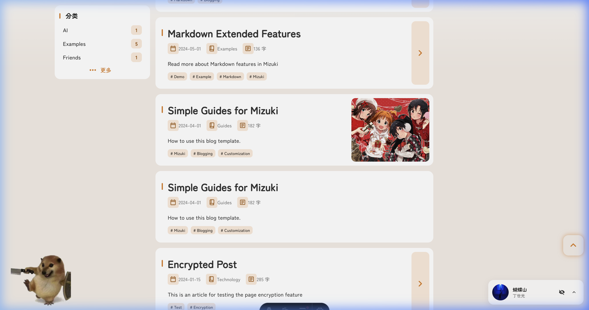
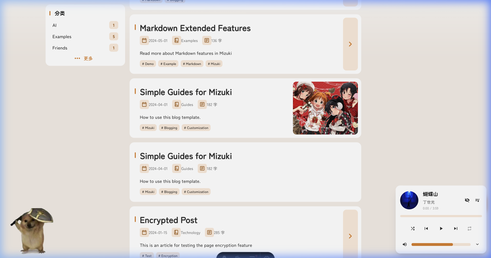
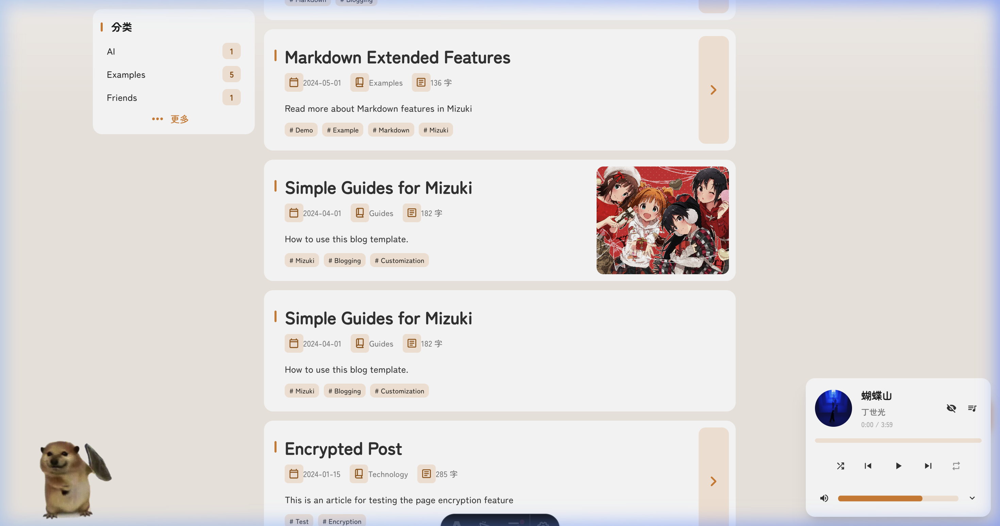
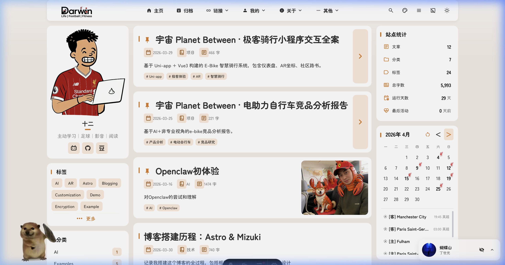
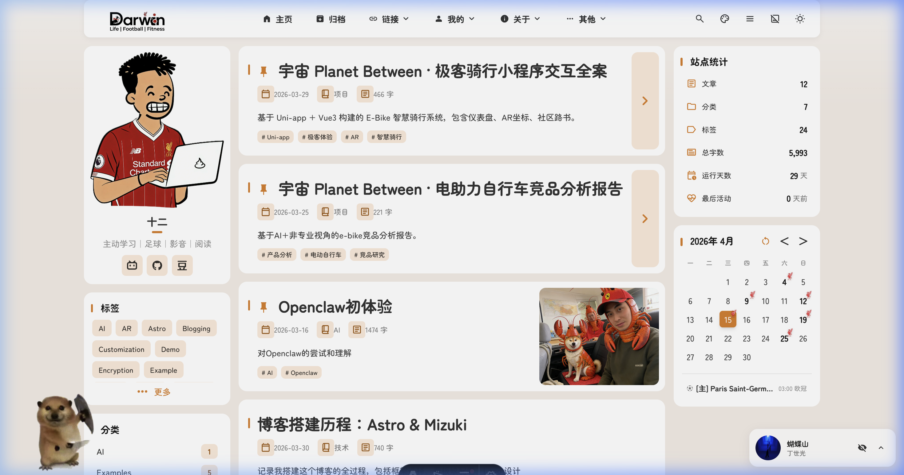

# 博客搭建历程：从框架选择到精细打磨

搭建一个属于自己的数字花园，不仅是技术的积累，更是审美的表达。本篇文章将带你走进我博客搭建的幕后故事。

---

## 1. 缘起：为何选择 Astro & Mizuki

在众多静态网站生成器中，我最终选择了 **[Astro](https://astro.build/)**。它的“群岛架构”（Islands Architecture）和极速的加载性能深深吸引了我。

而 **Mizuki** 模板则为这个博客注入了灵魂。设计风格比较可爱，还深度集成了 Svelte 组件，让动态功能的实现变得优雅且高效。


*图1：博客首页预览，展示了 Logo、横幅与全局布局*

---

## 2. 核心成员：刀盾小狗看板娘

为了让博客更具互动性，我本想引入了基于 **Paul-Pio** 的 Live2D 组件。

### 刀盾小狗的诞生
最初考虑过多种 Live2D 模型，但最终被这只可爱的“刀盾小狗”征服了。
- **模型优化**：为了配合博客的简洁风格，我使用了处理后的透明模型文件 `dog_transparent.webp`。
- **交互配置**：在 `src/config.ts` 中，我为它配置了专属的对话：“我的刀盾！”、“下次再见~”等，让它成为了我网站最忠实的守护者。

```typescript
// src/config.ts 中的 Pio 配置
export const pioConfig: PioConfig = {
  enable: true,
  models: ["/pio/models/dog_transparent.webp"],
  position: "left",
  width: 150,
  height: 150,
  dialog: {
    welcome: "Welcome to Darwin's world!",
    touch: ["What's the dog doing?", "我的刀盾！"],
  },
};
```

---

## 3. 灵魂设计：网站 Logo 与 视觉风格

### Logo 设计
Logo 是个人品牌的基石。我设计了以 **Darwin** 为核心的图标。
- **适配性**：为了兼容深浅主题，我准备了 `Darwin.png` 和 `Darwin-white.png` 两个版本。
- **图标集成**：在顶栏中，通过 `navbarTitle` 配置实现了 Logo 的优雅展示。

### 视觉体验
- **动态交互**：集成了 [Swup](https://swup.js.org/) 实现页面间的平滑过渡动画，消除切换时的割裂感。
- **滚动布局**：通过侧边栏和主网格的错落排布，保证了信息密度的平衡。


*图2：页面滚动后的视觉呈现，看板娘与侧边栏完美融合*

---

## 4. 听觉享受：全局音乐播放器

一个温馨的数字花园怎能没有良曲相伴？

我实现了一个由 Svelte 驱动的 **MusicPlayer** 组件：
- **本地化歌单**：收录了我钟爱的丁世光、方大同、蔡健雅等音乐人的作品。
- **交互体验**：支持迷你圆球模式与完整展开模式，配备了波形动画和毛玻璃特效。


*图3：展开后的音乐播放器界面*

---

## 5. 功能进阶：动态日历与 LFC 赛程同步

为了让这个数字花园更加“鲜活”，我开发了一个多功能的动态日历组件，它不仅是时间的刻度，更是生活的记录仪。

### 笔记与日记的聚合
日历挂件会自动索引我的所有文章和日记（Diary）。
- **即时预览**：点击日历上的日期，下方列表会立即显示当天记录的随笔或发布的文章。
- **可视化标记**：有内容的日期会显示小圆点，方便快速回顾。

### 利物浦比赛实时同步 (LFC Real-time Update)
作为一个死忠红军球迷，我为日历加入了一个酷炫的功能：**LFC 赛程自动更新**。
- **自动化脚本**：我编写了 `scripts/update-lfc.mjs`，通过 Axios 抓取 `fixtur.es` 的 ICS 赛程数据，并解析为本地 JSON。
- **更新指令**：只需在终端执行以下命令，即可一键同步最新赛程：
  ```bash
  pnpm update-lfc
  ```
- **动态图标**：在利物浦的比赛日，日历上会出现显眼的 **Liverbird (小鸟)** 图标。
- **多维度信息**：点击图标即可看到比赛时间（北京时间）、对手、赛事类型（欧冠、英超等）以及实时比分（若比赛已结束）。


*图4：2026年4月的日历，可以看到多个利物浦比赛标记*


*图5：点击比赛日后显示的利物浦 vs PSG 欧冠比赛详情*

---

## 6. 后续规划

目前的博客已经初具规模，但完善的道路永无止境：
- [ ] 进一步优化 CJK 字体的加载效率。
- [ ] 增加更多互动微交互。
- [ ] 完善移动端的极致体验。

感谢你见证这个博客的成长！